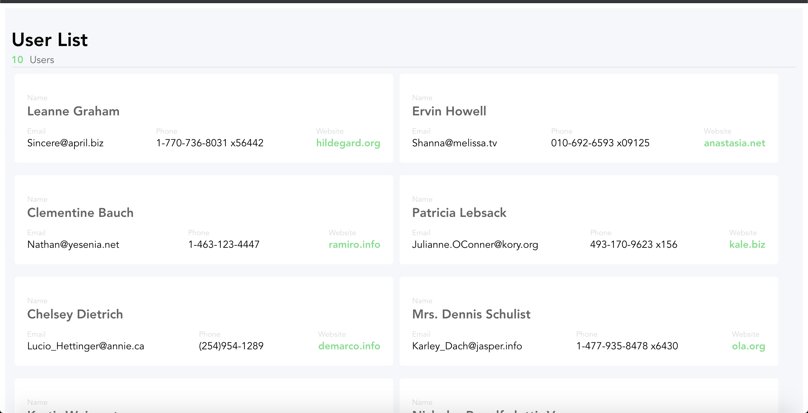

# vue-test-code

## Project setup
```
yarn install
```

### Compiles and hot-reloads for development
```
yarn serve
```

### Compiles and minifies for production
```
yarn build
```

### Lints and fixes files
```
yarn lint
```

### Program Explanation
```
First when i run the program there is 3 unused var. Unused var is warning and not error so i turn off the warning in package.json by adding "no-unused-vars": "off" inside esLint config rules. After that i can see where the app has been made which is just the toolbar that being shown. I immediatly recognised that the count number is not in line with "Users" so i changed it in Users.vue to become inside one div. Another change is :
store.js :
- setData inside context.commit inside actions changed to SET_DATA to make it the same as one inside the mutations
- in mutations lists changed to list to make it same as one inside the state
Users.vue :
- inside methods change setData inside dispatch to setDatas to make it the same as one actions in store.js file

After the change above is made the json data is succesfully being stored in users inside Users.vue by getters. For the users count i change getCountData function in store.js to return state.list.length; to make it simple. After that the sum of the users has been succesfully saved in count at Users.vue by getters. So mapState and INCREMENT is not used and i deleted it.
After that i customized the style in css to make the appearance is the same as the expected picture.
I use display flex to control the box 2 in a line. Adjusted text color,size and the background size and the space between them.
```

### Customize configuration
See [Configuration Reference](https://cli.vuejs.org/config/).

Expected Output :
